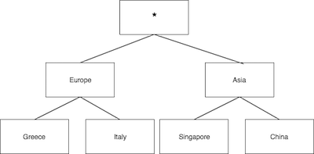

# Anonymizing a CSV dataset

The anonymization algorithms require 4 input parameters:

1. The dataset to be loaded. The current anonymization algorithms support CSV datasets
2. A list of ColumnInformation objects. These objects contain information about the column: if the column is categorical or numerical, if it is quasi, sensitive or non-sensitive, the weight they contribute to the information loss and if they are considered as part of the linking attributes for re-identification risk calculation. The `Column Information` section includes further details
3. A list of privacy constraints. These constraints specify the k-anonymity and/or l-diversity and/or t-closeness privacy guarantees that the algorithms must achieve. The `Privacy constraints` describes in detail how to construct the privacy constraints objects
4. Algorithm-specific options

## Available algorithms

The following table describes the available anonymization algorithms:

|Algorithm Name| 
|--------------|
|Optimal Lattice Anonymization (OLA)|
|Mondrian|
|KMeans|


## Invocation of the algorithms

The steps to invoke an anonymization algorithm are the following:

1 Create an AnonymizationAlgorithm instance, for example:

```java
AnonymizationAlgorithm ola = new OLA();
AnonymizationAlgorithm mondrian = new Mondrian();
AnonymizationAlgorithm kMeans = new KMeans();
```  

2 Initialize the algorithm and pass the dataset, column information, privacy constraints and the algorithm specific options

The initialization method definition is the following:

```java
 AnonymizationAlgorithm initialize(
 					IPVDataset dataset, 
 					List<ColumnInformation> columnInformationList,
                	List<PrivacyConstraint> privacyConstraints, 
                	AnonymizationAlgorithmOptions options);
```

3 Call the `apply()` method to get the anonymized dataset. The function will return an `IPVDataset`:

```java
IPVDatased anonymized  = ola.apply()
```

## Column information 

The anonymization algorithms require to know information about each column.

### Quasi columns

#### Categorical 

In order to represent a categorical quasi-column, we need to instantiate a `CategoricalInformation` object. The constructor is the following:

```java
public CategoricalInformation(
	GeneralizationHierarchy hierarchy, 
	ColumnType columnType, 
	double weight, 
	int maximumLevel, 
	boolean isForLinking);
```

and requires five parameters:

1 The `hierarchy` which is the generalization hierarchy for the attribute. See the next Section for details how to generate hierarchies
2 The `columnType` for this column. This should have the value `ColumnType.QUASI` since we need to represent a quasi-identifier
3 The `weight` which is the weight we should for that column when calculating the information loss.
4 The `maximumLevel` which is the maximum generalization level we want to apply. This level is only considered when we use the `OLA` algorithm. If the value is -1 then there is no maximum level applied.
5 A boolean `isForLinking` that denotes if the column should be considered as part of the linking attributes when we calculate the re-identification risk.  


#### Numerical

In order to represent a numerical quasi-column, we need to instantiate a `NumericalRange` object. 
The numerical quasi-identifiers are considered in the case of `Mondrian` and `KMeans`. 

The constructor is the following:

```java
public NumericalRange(
	List<Double> sortedValues, 
	ColumnType columnType, 
	double weight, 
	boolean isForLinking);
```

and requires five parameters:

1 A list of Double objects that **must be sorted**
2 The `columnType` for this column. This should have the value `ColumnType.QUASI` since we need to represent a quasi-identifier
3 The `weight` which is the weight we should for that column when calculating the information loss.
4 A boolean `isForLinking` that denotes if the column should be considered as part of the linking attributes when we calculate the re-identification risk. 


There is a utility function located in the `com.ibm.research.drl.prima.anonymization.ColumnInformationGenerator` class that generates a `NumericalRange` object based on a dataset and the column index of the numerical attribute that we want to extract the information for:

```java
    public static NumericalRange generateNumericalRange(
    		IPVDataset dataset, 
    		int column, 
    		ColumnType columnType, 
    		double weight, 
    		boolean isForLinking);
``` 

### Sensitive columns

If a column is considered sensitive then we can instantiate a `SensitiveColumnInformation`:

```java
ColumnInformation sensitive = new SensitiveColumnInformation();
```

The default constructor does not consider the column as part of the linking attributes. If we want to make the column part of the linking attributes, then we can specify it as:

```java
ColumnInformation sensitive = new SensitiveColumnInformation(true);
```

### Non-quasi, non-sensitive columns

If a column is non-quasi and non-sensitive then we can instantiate a `DefaultColumnInformation`:

```java
ColumnInformation normal = new DefaultColumnInformation();
```

The default constructor does not consider the column as part of the linking attributes. If we want to make the column part of the linking attributes, then we can specify it as:

```java
ColumnInformation normal = new DefaultColumnInformation(true);
```

## Hierarchies

There are two types of hierarchies: a) materialized hierarchies, where the elements of the hierarchy are finite, manageable and can be specified in a structure (for example, a gender attribute has two elements) and b) computational-based where the number of elements are either infinite or too many to form a materialized hierarchy. For example, GPS coordinates and their generalizations are way too many to pre-specify them in a materialized hierarchy (only the specification would need several gigabytes of disk space).  

### Specifying a materialized hierarchy

Materialized hierarchies can be regarded as n-ary trees. The root of the tree is called the top term
of the hierarchy while the leaves are the values encountered in the data. 

The following example shows how to create a materialized hierarchy. We add a list
of Strings, where the first element is the original value, the middle values are the generalizations and the final value is the top terms. The top terms for every row must match. 

```java
public MaterializedHierarchy createCountryHierarchy() {

	MaterializedHierarchy terms = new MaterializedHierarchy();
	
   terms.add(Arrays.asList("Greece", "Europe", "*"));
   terms.add(Arrays.asList("Italy", "Europe", "*"));
   terms.add(Arrays.asList("Singapore", "Asia", "*"));
   terms.add(Arrays.asList("China", "Asia", "*"));
   
   return terms;
}
```

The visual representation for the example above is the following:



### Utility functions for hierarchy generation

#### Use one of the pre-defined hierarchies

The toolkit contains several pre-defined hierarchies. In order to retrieve one of the pre-defined hierarchies, the `getDefaultHierarchy` from the `GeneralizationHierarchyFactory` class can be invoked:

```java
public static GeneralizationHierarchy getDefaultHierarchy(ProviderType type);
```

The following table contains a list of the available hierarchies along with the provider type that needs to be used as a parameter and the description of the generalization levels:

|Hierarchy|ProviderType|Generalization levels|
|---|---|---|
|City|ProviderType.CITY|City, country, continent, \*|
|Country|ProviderType.COUNTRY|Country, continent, \*|
|Gender|ProviderType.GENDER|Gender, \*|
|Race|ProviderType.RACE|Race, \*|
|Marital status|ProviderType.MARITAL_STATUS|Marital status, category (alone or in-marriage), \*|
|ZIP code|ProviderType.ZIPCODE|5-digit value, 4-digit value, 3-digit value, 2-digit value, 1-digit value, \*|


#### Simple two-level hierarchy from a list of values

If we want to create a hierarchy which has two levels, the original values and the top term, 
we can invoke the `getGenericFromFixedSet` function from the `GeneralizationHierarchyFactory` class:

```java
public static GeneralizationHierarchy 
		getGenericFromFixedSet(List<String> terms, String topTerm);
```

For example, if we have the values `A`, `B` and `C` and we want a simple two-level hierachy with 
the top term being `*` then we can create it as:

```java
import com.ibm.research.drl.prima.anonymization.hierarchies.GeneralizationHierarchyFactory;

GeneralizationHierarchy hierarchy = 	
	GeneralizationHierarchyFactory.getGenericFromFixedSet(Arrays.asList("A", "B", "C"), "*");
```

### Developer guide for implementing a generalization hierarchy

A class that wants to implement a generalization hierarchy needs to implement the `com.ibm.research.drl.prima.algorithms.anonymization.hierarchies.GeneralizationHierarchy` interface.

The interface contains the following methods:

```
int getHeight();
int getTotalLeaves();
int leavesForNode(String value);
Set<String> getNodeLeaves(String value);
int getNodeLevel(String value);
String getTopTerm();
String encode(String value, int level, boolean randomizeOnFail);
```

The `getHeight` function returns the height of the hierarchy.

The `getTotalLeaves` returns the number of leaves of the hierarchy.

The `leavesForNode` returns the number of leaves of a specific node in the hierarchy. The `getNodeLeaves` functions returns a set of these leaves.

The `getNodeLevel` returns the level of a value in the hierarchy.

The `getTopTerm` returns the value of the top term in the hierarchy.

The `encode` function is responsible for encoding a value to a generalization level.

Let's assume that we want to implement a hierarchy for 5-digit ZIP codes. In each level of the hierarchy, a digit of the ZIP code will be replaced by an asterisk. For example, the ZIP code 12345 will become 1234* at level 1, 123** at level 2 and so on and finally at level 5 it will be *****.

This hierarchy has 6 levels:

```
int getHeight() { 
	return 6;
}
```

The total leaves of the hierarchy are 10000 (all 5-digit ZIP codes):

```
int getTotalLeaves() {
	return 10000;
}
```

The top term for the hierarchy is `*****`:

```
String getTopTerm() {
	return "*****";
}
```

For an input value, its level in the hierarchy is the number of asterisks it has:

```
 public int getNodeLevel(String value) {
        int level = 0;

        for(int i = (value.length() - 1); i >= 0; i++) {
            if (value.charAt(i) == '*') {
                level++;
            }
        }

        return level;
}
```


If we have as input value "1234*", then we know that it has 10 leaves

```
int leavesForNode(String value) {
	int level = getNodeLevel(value);
   	return (int)Math.pow(10, level);
}
```

The `encode` function replaces the digits of the ZIP code based on the level specified (one level means the last digit replaces, two levels means the last two digits replaced and so on).

```
 public String encode(String value, int level, boolean randomizeOnFail) {
        if (level <= 0) {
            return value;
        }

        if (level >= getHeight()) {
            return getTopTerm();
        }

        if (value.length() != 5) {
            return getTopTerm();
        }

        String prefix = value.substring(0, value.length() - level);

        for(int i = 0; i < level; i++) {
            prefix += "*";
        }

        return prefix;
    }
```


## Privacy constraints

The anonymization algorithm requires a list of privacy constraints to operate. This list must include the k-anonymity constraint and then optionally the l-diversity and/or the t-closeness constraint.

### K-anonymity

The k-anonymity constraint is initialized as:

```java
import com.ibm.research.drl.prima.anonymization.constraints.KAnonymity;

int k = 2;
PrivacyConstraint kAnonymity = new KAnonymity(k);
```

### L-diversity

The toolkit contains three variants of L-diversity: distinct, entropy-based and recursive CL.

#### Distinct L-diversity

The distinct L-diversity is initialized as:

```java
import com.ibm.research.drl.prima.anonymization.constraints.DistinctLDiversity;

int l = 2;
PrivacyConstraint distincLDiversity = new DistinctLDiversity(l);
```

where the `l` parameter represents the number of unique values within each equivalence class

#### Entropy-based L-diversity

```java
import com.ibm.research.drl.prima.anonymization.constraints.EntropyLDiversity;

int l = 2;
PrivacyConstraint entropyLDiversity = new EntropyLDiversity(l);
```

#### Recursive CL-Diversity

```java
import com.ibm.research.drl.prima.anonymization.constraints.RecursiveCLDiversity;

int l = 2;
double c = 0.1;
PrivacyConstraint entropyLDiversity = new RecursiveCLDiversity(l, c);
```

### T-closeness

```java
import com.ibm.research.drl.prima.anonymization.constraints.TCloseness;

PrivacyConstraint tCloseness = new TCloseness();
```

## Algorithm-specific options

Mondrian and KMeans have no specific options. A `null` value can be safely passed to their constructor.

For the case of OLA we pass a `OLAOptions` object which expects the maximum suppression rate as an input parameters, for example initializing OLA options with a 2% maximum suppression rate:

```java
import com.ibm.research.drl.prima.anonymization.ola.OLAOptions;

AnonymizationAlgorithmOptions olaOptions = new OLAOptions(2.0);
```

## Loading a dataset

The toolkit supports CSV datasets and provides an abstraction of the data through the `IPVDataset` class. The dataset can be initialized from an `InputStream`, a `Reader` object, a file path or from an in-memory list of values. 

The following constructor builds an `IPVDataset` by loading data from an input stream. The flag `hasHeader` denotes if the first row of the file should be treated as the CSV header. The `fieldDelimiter` represents the field delimiter and `quoteChar` is the quote character for the CSV parsing.

```java
public static IPVDataset load(
		InputStream inputStream, 
		boolean hasHeader, 
		Character fieldDelimiter,
		Character quoteChar) throws IOException
```

Other overloads are based on `Reader` 

```java
public static IPVDataset load(
		Reader reader, 
		boolean hasHeader, 
		Character fieldDelimiter,
		Character quoteChar) throws IOException
```

and file names:

```java
public static IPVDataset load(
		String filename, 
		boolean hasHeader, 
		Character fieldDelimiter,
		Character quoteChar) throws IOException
```

## Examples 

### Anomymizing a dataset using OLA and 2% maximum suppression rate

For this example, we assume a dataset with the name  with 4 columns. The first column is a patient ID which is already hashed, and we consider it as non-quasi and non-sensitive. The next three columns are quasi-identifiers: gender, race and ZIP code. We will use the pre-defined hierarchies available in the toolkit. 

```java
import com.ibm.research.drl.prima.anonymization.*;
import com.ibm.research.drl.prima.anonymization.constraints.KAnonymity;
import com.ibm.research.drl.prima.anonymization.hierarchies.GeneralizationHierarchy;
import com.ibm.research.drl.prima.anonymization.hierarchies.GeneralizationHierarchyFactory;
import com.ibm.research.drl.prima.datasets.IPVDataset;
import com.ibm.research.drl.prima.providers.ProviderType;

import java.io.File;
import java.io.FileInputStream;
import java.io.FileNotFoundException;
import java.io.IOException;
import java.util.ArrayList;
import java.util.List;

public class OLAAnonymizationExample {
    
    public static IPVDataset anonymizeDataset(String filename) throws FileNotFoundException, IOException {
    
        GeneralizationHierarchy genderHierarchy = GeneralizationHierarchyFactory.getDefaultHierarchy(ProviderType.GENDER);
        GeneralizationHierarchy raceHierarchy = GeneralizationHierarchyFactory.getDefaultHierarchy(ProviderType.RACE);
        GeneralizationHierarchy zipcodeHierarchy = GeneralizationHierarchyFactory.getDefaultHierarchy(ProviderType.ZIPCODE);
        
        List<ColumnInformation> columnInformation = new ArrayList<>();
        columnInformation.add(new DefaultColumnInformation(false)); 
        columnInformation.add(new CategoricalInformation(genderHierarchy, ColumnType.QUASI, 1.0, -1, true));
        columnInformation.add(new CategoricalInformation(genderHierarchy, ColumnType.QUASI, 1.0, -1, true));
        columnInformation.add(new CategoricalInformation(raceHierarchy, ColumnType.QUASI, 1.0, -1, true));
        columnInformation.add(new CategoricalInformation(zipcodeHierarchy, ColumnType.QUASI, 1.0, -1, true));

        int k = 10;
        double maximumSuppressionRate = 2.0;
        
        IPVDataset originalDataset = IPVDataset.load(new FileInputStream(new File(filename))); //we load the file
       
        List<PrivacyConstraint> privacyConstraints = new ArrayList<>();
        privacyConstraints.add(new KAnonymity(k)); // we add the k-anonymity constraint
        
        AnonymizationAlgorithm ola = new OLA(); //we instantiate and initialize the anonymization algorithm
        ola.initialize(originalDataset, columnInformation, privacyConstraints, new OLAOptions(maximumSuppressionRate));
        
        IPVDataset anonymizedDataset = ola.apply(); 

        System.out.println(ola.reportSuppressionRate());
        
        return anonymizedDataset;
    }
}
```


### Anonymizing a dataset using Mondrian

For this example, we assume a dataset with the name  with 5 columns. The first column is a patient ID which is already hashed and we consider it as non-quasi and non-sensitive. The next four columns are quasi-identifiers: gender (categorical), race (categorical), ZIP code (categorical) and height (numerical). We will use the pre-defined hierarchies available in the toolkit for the categorical quasis. 

```java
import com.ibm.research.drl.prima.anonymization.*;
import com.ibm.research.drl.prima.anonymization.constraints.KAnonymity;
import com.ibm.research.drl.prima.anonymization.hierarchies.GeneralizationHierarchy;
import com.ibm.research.drl.prima.anonymization.hierarchies.GeneralizationHierarchyFactory;
import com.ibm.research.drl.prima.anonymization.mondrian.Mondrian;
import com.ibm.research.drl.prima.datasets.IPVDataset;
import com.ibm.research.drl.prima.providers.ProviderType;

import java.io.File;
import java.io.FileInputStream;
import java.io.FileNotFoundException;
import java.io.IOException;
import java.util.ArrayList;
import java.util.List;

public class MondrianAnonymizationExample {
    
    public static IPVDataset anonymizeDataset(String filename) throws FileNotFoundException, IOException {
        IPVDataset originalDataset = IPVDataset.load(new FileInputStream(new File(filename))); //we load the file
        
        GeneralizationHierarchy genderHierarchy = GeneralizationHierarchyFactory.getDefaultHierarchy(ProviderType.GENDER);
        GeneralizationHierarchy raceHierarchy = GeneralizationHierarchyFactory.getDefaultHierarchy(ProviderType.RACE);
        GeneralizationHierarchy zipcodeHierarchy = GeneralizationHierarchyFactory.getDefaultHierarchy(ProviderType.ZIPCODE);
        ColumnInformation heightInformation = ColumnInformationGenerator.generateNumericalRange(originalDataset, 4, ColumnType.QUASI, 1.0, true); //we generate the height column information from the data
        
        List<ColumnInformation> columnInformation = new ArrayList<>();
        columnInformation.add(new DefaultColumnInformation(false)); 
        columnInformation.add(new CategoricalInformation(genderHierarchy, ColumnType.QUASI, 1.0, -1, true));
        columnInformation.add(new CategoricalInformation(raceHierarchy, ColumnType.QUASI, 1.0, -1, true));
        columnInformation.add(new CategoricalInformation(zipcodeHierarchy, ColumnType.QUASI, 1.0, -1, true));
        columnInformation.add(heightInformation);
        
        int k = 10;
       
        List<PrivacyConstraint> privacyConstraints = new ArrayList<>();
        privacyConstraints.add(new KAnonymity(k)); // we add the k-anonymity constraint
        
        AnonymizationAlgorithm mondrian = new Mondrian(); //we instantiate and initialize the anonymization algorithm
        mondrian.initialize(originalDataset, columnInformation, privacyConstraints, null);
        
        IPVDataset anonymizedDataset = mondrian.apply(); 

        return anonymizedDataset;
    }
}
```
